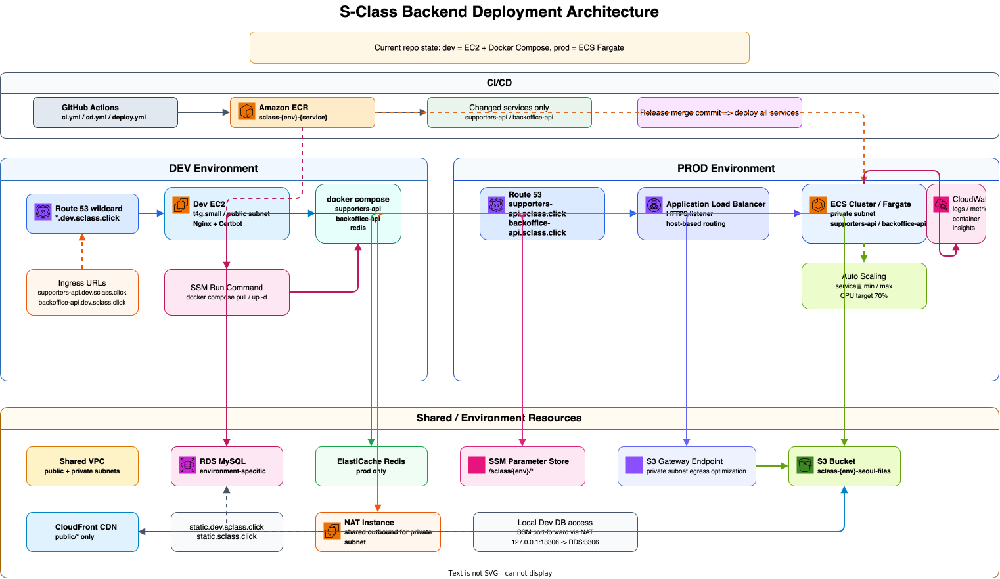
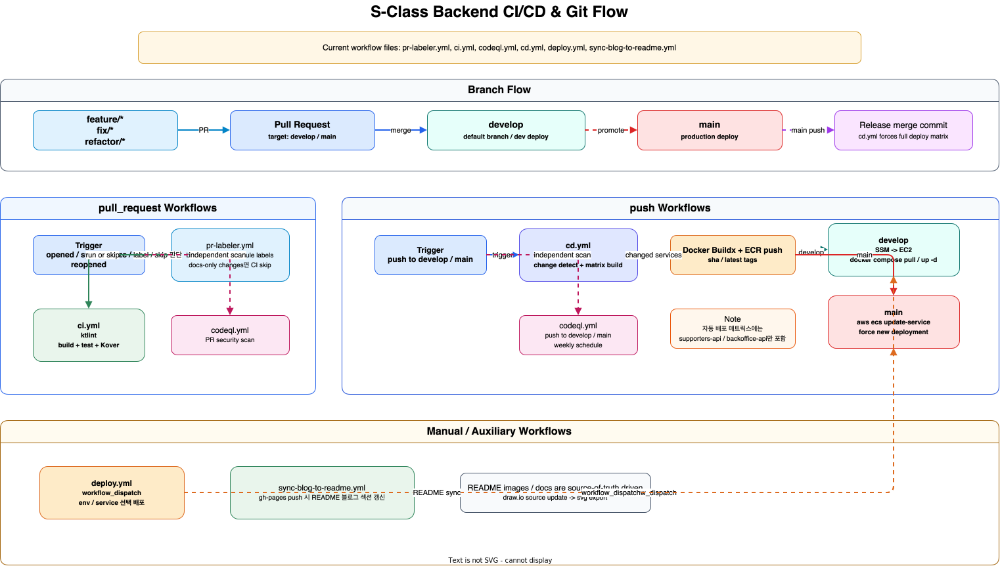

# S-Class Backend


수행평가 매칭과 학원 운영을 지원하는 S-Class 백엔드 monorepo입니다.

- **Supporters** — 학생/학부모/교사를 위한 수행평가 매칭 API
- **Backoffice** — 운영진 전용 관리 API
- **Batch** — 정산·후처리 배치 애플리케이션

## Tech Stack

- **Runtime**: Spring Boot 4.0.3, Kotlin 2.2.21, Java 21
- **Data**: MySQL 8.0, Redis 7, JPA + QueryDSL, Quartz
- **Infra**: Terraform, AWS ECS Fargate(prod), EC2 + Docker Compose(dev), ALB, ECR, RDS, ElastiCache, S3, CloudFront, SSM Parameter Store, Route 53, CloudWatch
- **Tooling**: GitHub Actions, CodeQL, ktlint 1.5.0, Kover

## Modules

| Module | 역할 | 현재 배포 상태 |
| --- | --- | --- |
| `SClass-Common` | 공통 유틸, DTO, 예외, JWT, 어노테이션 | 라이브러리 |
| `SClass-Domain` | 엔티티, 리포지토리, 어댑터, 도메인 서비스 | 라이브러리 |
| `SClass-Infrastructure` | S3, OAuth, NicePay, 알림톡, Quartz 등 외부 연동 | 라이브러리 |
| `SClass-Api-Supporters` | `supporters-api` 부트 애플리케이션 | 자동 배포 대상 |
| `SClass-Api-Backoffice` | `backoffice-api` 부트 애플리케이션 | 자동 배포 대상 |
| `SClass-Batch` | 배치 애플리케이션 | 현재 CD 매트릭스 제외 |

현재 저장소에는 예전 문서에 있던 `SClass-Api-Lms` 모듈이 없습니다. GitHub Actions `cd.yml` 기준 자동 배포 대상은 `supporters-api`, `backoffice-api` 두 서비스입니다.

## Local Development

1. MinIO와 Redis를 띄웁니다.

```bash
docker compose up -d
docker compose -f infra/docker-compose.dev.yml up -d redis
```

2. Dev DB를 로컬 `13306`으로 포워딩합니다.

[DEV_DB_ACCESS.md](DEV_DB_ACCESS.md)

3. 필요한 API를 실행합니다.

```bash
./gradlew :SClass-Api-Supporters:bootRun
./gradlew :SClass-Api-Backoffice:bootRun
```

기본 로컬 설정은 `supporters-api` `8081`, `backoffice-api` `8082`, Dev DB `127.0.0.1:13306/sclass_dev`, Redis `127.0.0.1:6379`, MinIO `127.0.0.1:9000` 기준입니다.

## Build & Lint

```bash
./gradlew clean build
./gradlew ktlintCheck
./gradlew ktlintFormat
```

첫 빌드 시 Git hooks가 자동 설정됩니다.

## Deployment

| Environment | Ingress | Runtime | Deploy 방식 |
| --- | --- | --- | --- |
| `dev` | `*.dev.sclass.click` | 퍼블릭 EC2 1대(`t4g.small`) + Nginx/Certbot + Docker Compose | GitHub Actions가 SSM Run Command로 갱신 |
| `prod` | `supporters-api.sclass.click`, `backoffice-api.sclass.click` | ALB + private subnet ECS Fargate | GitHub Actions가 ECR push 후 `aws ecs update-service --force-new-deployment` 실행 |

공유 인프라는 다음 구성을 사용합니다.

- shared VPC(public/private subnet) + NAT instance + S3 Gateway Endpoint
- 환경별 RDS MySQL
- prod 전용 ElastiCache Redis
- 환경별 S3 버킷 + CloudFront 정적 CDN(`static.dev.sclass.click`, `static.sclass.click`)
- SSM Parameter Store, ECR, CloudWatch

## CI/CD

- `pull_request` to `develop` / `main`
  - `pr-labeler.yml`: 브랜치/모듈 라벨링, docs-only 변경이면 CI skip
  - `ci.yml`: ktlint, build, test, Kover comment
  - `codeql.yml`: PR 보안 스캔
- `push` to `develop` / `main`
  - `cd.yml`: 변경 파일 기반으로 배포 매트릭스 구성
  - Docker Buildx로 모듈별 이미지 빌드 후 ECR push
  - `develop`은 dev EC2 배포, `main`은 prod ECS 배포
- `workflow_dispatch`
  - `deploy.yml`: env / service 지정 수동 배포
- `gh-pages` push
  - `sync-blog-to-readme.yml`: 아래 블로그 목록 자동 갱신

릴리즈 머지 커밋은 path filter 결과와 무관하게 전체 서비스를 배포하도록 `cd.yml`에 반영되어 있습니다.

## Related Docs

- [ARCHITECTURE.md](ARCHITECTURE.md)
- [DEV_DB_ACCESS.md](DEV_DB_ACCESS.md)

## Engineering Blog

아래 목록은 블로그 글 제목 자동 동기화 영역이며, 현재 운영 환경 설명은 이 README의 Deployment 섹션과 아키텍처 다이어그램 기준입니다.

<!-- BLOG_POSTS_START -->
- [수업을 '시작'하는 API는 POST일까 PATCH일까](https://seeun0210.github.io/s-class-backend/lesson-lifecycle-http-method-2026-04-26.html) — `아키텍처 결정` · 2026-04-26
- [App Runner에서 외부 API 호출이 10초 만에 죽는다](https://seeun0210.github.io/s-class-backend/troubleshooting-nat-forward-2026-04-05.html) — `트러블슈팅` · `DevOps` · 2026-04-05
- [알림톡, 트랜잭션이 끝난 뒤에 보내야 한다](https://seeun0210.github.io/s-class-backend/adr-async-alimtalk-2026-04-02.html) — `아키텍처 결정` · 2026-04-02
- [@Scheduled 대신 Quartz — 동적 스케줄과 취소](https://seeun0210.github.io/s-class-backend/quartz-dynamic-scheduler-2026-04-02.html) — `아키텍처` · `DevOps` · 2026-04-02
- [App Runner에서 앱이 뜨질 않는다](https://seeun0210.github.io/s-class-backend/troubleshooting-2026-03-25.html) — `트러블슈팅` · `DevOps` · 2026-03-25
- [MSA로 시작했다가 Modular Monolith로 바꾼 이야기](https://seeun0210.github.io/s-class-backend/architecture-monorepo-2026-03-08.html) — `아키텍처` · `Kotlin · Spring` · 2026-03-08
<!-- BLOG_POSTS_END -->

## AWS Architecture



## CI/CD & Git Flow


